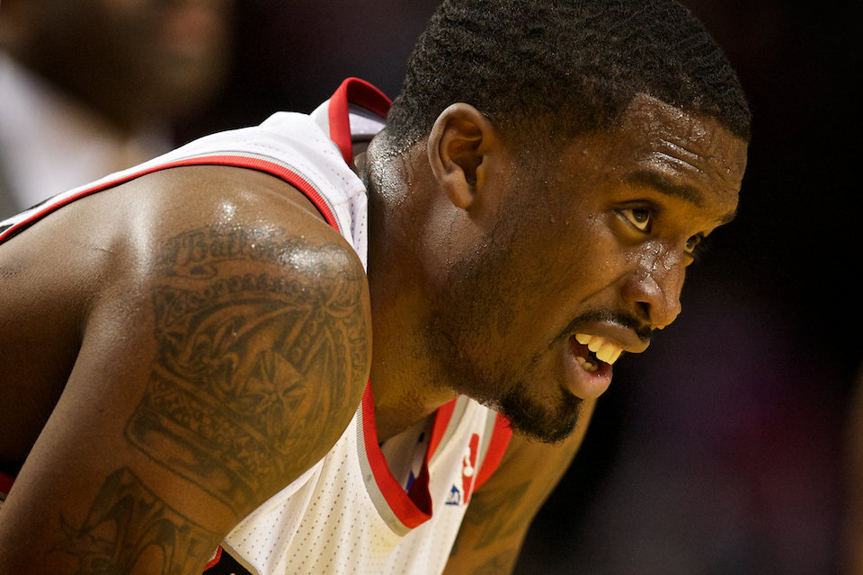
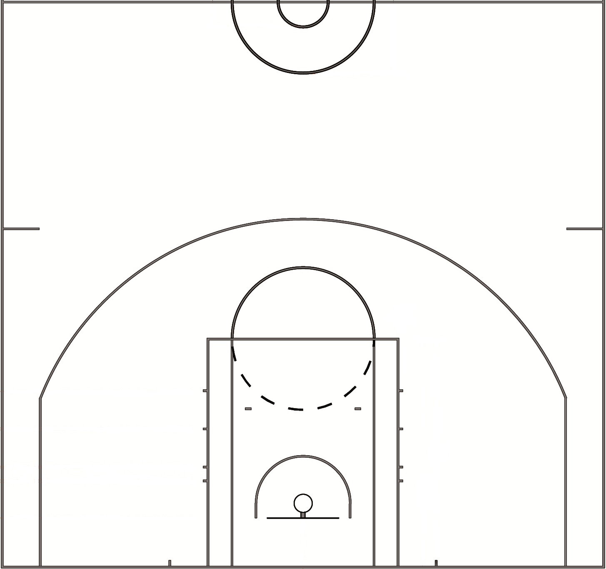

#<span style="color:blue2">Is Fatigue even a problem for the best NBA shooters?</span>
```{r out.width='80%', echo=FALSE, fig.align = 'center'}


```

# 1 THE CONTEXT : 
As fans of basketball, we enjoy ourselves playing hard on the courts. We step onto the court, we are aggressive, and we play well when we are fresh. However, with the constant hard work over time, our legs get tired, our arms get sore and our shooting forms get out of shape. We may find ourselves busy at catching breaths than making the baskets. There is no denial our stamina affect our performances. 

But how about the top professional NBA players? These players are paid [millions of dollars](https://www.forbes.com/sites/kurtbadenhausen/2017/07/03/these-19-nba-players-earn-more-than-any-nfl-player/) each year to be at the top of the pyramid. In addition to their outstanding genetics, the professional players have  coaches to instruct them to stay in their best shape possible.  Performances such as the [81-point game](https://www.nytimes.com/2006/01/23/sports/basketball/bryant-scores-81-secondhighest-total.html) by Kobe Bryant over the 48-minute time frame seems to suggest that the top players are just functioning like machines, scoring point after point, and stamina does not seem be a factor. 

But are professional NBA players really machines? Let us try to find out. 

There are [various metrics](https://www.nbastuffer.com/player-evaluation-metrics/) assessing players' performances, from the basics such as *Points Produced* to advanced metrics including *Player Efficiency Rating(PER)* and *Quantified Shot Quality (qSQ)*. In this article, we will keep it simple: we will just assess the players' performances by their shot statistics and observe their shooting percentages and short charts. 

To select a sample population to study, we will use an extreme example: The Golden State Warriors (GSW) from 2016-17. With the addition of Kevin Durant, a [4-time NBA scoring Champion](https://en.wikipedia.org/wiki/Kevin_Durant), the GSW has proven once again that it is the best team on the offsensive end by having the [highest effective field goal percentage of all time](https://www.nba.com/article/2017/12/14/one-team-one-stat-warriors-shooting-better-ever). Spefically, we will use data of the 5 GSW players: *Andre Iguodala*, *Draymond Green*, *Kevin Durant*, *Klay Thompson* and *Stphen Curry*, known as the *SuperDeath Lineup* and the backbone of the GSW, to conduct our analysis in this article. 

```{r out.width='80%', echo=FALSE, fig.align = 'center'}

```

There are **assumptions** made in this analysis. We can only learn  players' level of fatigue through their verbal responses, and unfortunately there is no quantifible data available. Thus, We will make the assumption that the longer the game has been played, the more tired the players become. 

With the sample determined and assumption established, now it is time to start looking at some data. 

# 2 DATA PREPARATION: 
Thanks to the popularity of NBA, there are numerous professional analysts and fans working with NBA data so the data with features we need for the 5 individuals players are reaily [ available here](https://github.com/ucb-stat133/stat133-hws/tree/master/data). 

Let us inspect the data variables of the csv files. We can look at the statistics of *Andre Iguodala* as a reference since the data of all players follow the same format:
```{r}
str(read.csv("../data/andre-iguodala.csv", stringsAsFactors = FALSE), vec.length = 1)
```

Based on the question we are trying to answer, while some variables such as *team_name* and *opponent* may not be directly related, other features such as *shot_made_flag* which tells us whether the shot was made, *shot_type* which tells us whether the shot was a 2-pointer or a 3-pointer, as well as *x* and *y* coordinates,  will be crucial to analyzing the shot statistics. Furthermore, I will add two more variables, *name* indicating who made the shot, and *minute* suggesting the amount of time since the game started, with the following command:

```{r eval=FALSE}
#Adding name: 
iguodala$name <- "Andre Iguodala"

#Adding minute column for Iguodala
iguodala$minute <- iguodala$period * 12 - iguodala$minutes_remaining #Every period is 12 min
```

Now we have added all the features we need for the analysis, but we are not done. To compare players' statistics, we want a global dataframe that combines all players' information. Furthermore, we can output summaries of individual players for readers interested in preliminary statistics. The code below can achieve what we want : 
```{r eval = FALSE}
#Construct global data frame
shots_data <- rbind(iguodala, green, durant, thompson, curry)
write.csv(
  x = shots_data, # R object to be exported
  file = "../data/shots-data.csv",  # file path 
  row.names = FALSE
)

#Output summary using Andre Iguodala as example
sink(file = "../output/andre-iguodala-summary.txt")
summary(iguodala)
sink()
```

With the global dataframe ready, we can now proceed to the analysis. 

# 3 DATA ANALYSIS: 
Let us divide the data analysis into 3 parts so it is easy for you to follow. 

In 3.1) we will create shot charts for the players since [70% of sensory perceptors are in our eyes](https://antranik.org/the-eye-and-vision/), therefore data visiualization is a very effective means of communication and forms a critical component of our analysis. 

In 3.2) we will calculate and compare players' *Effective Shooting Percentage (ESP)* , a fraction of the number of the shots they made out of the total number they attempted. 

in 3.3) we will explore relationship between the players' *ESP* with the periods when the shots occurred.

For the analysis, we will primarily use two packages, so let us load them: 
```{r, message = FALSE}
library (ggplot2)
library (dplyr)
```

## 3.1 Creating Shot Charts
To effectively visualize the shots' coordinates with respect to the court, we can add a nba court image and use it as the background for the shot charts. This is what our image looks like: 
```{r out.width='80%', echo=FALSE, fig.align = 'center'}


```

To set up, we import the jpg and convert it to a raster grahpical object and use it as background for ggplot in a moment. We can achieve it with the following command: 
```{r eval=FALSE}
court_file <- "../images/nba-court.jpg"
court_image <- rasterGrob(readJPEG(court_file), width = unit(1, "npc"), height = unit(1, "npc"))
```

Here using *Andre Iguodala* as example, we take in his dataframe, use the imported jpg image as background and build the geometic objects on top of it: 
```{r, eval = FALSE}
iguodala_shot_chart <- ggplot(data = iguodala) +
  annotation_custom(court_image, -250, 250, -50, 420) +
  geom_point(aes(x = x, y = y, color = shot_made_flag)) +
  ylim(-50, 420) +
  ggtitle('Shot Chart: Andre Iguodala (2016 season)') +
  theme_minimal()

```


By specificing the geometric points' colors, we can easily distinguish the made shots and missed shots:
```{r out.width='80%', echo=FALSE, fig.align = 'center'}
knitr::include_graphics("../images/andre-iguodala-shot-chart.png")

```

To visualize the shot charts of all 5 players in a single figure, we can use the global dataframe we created from last section, and use ggplot2's faceting feature and create the shot charts according to individual players. The code below achieves what we want:  

```{r eval = FALSE}
gsw_shot_charts <- ggplot(data = shots_data) +
  annotation_custom(court_image, -250, 250, -50, 420) +
  geom_point(aes(x = x, y = y, color = shot_made_flag)) + facet_wrap(~name) +
  ylim(-50, 420) +
  ggtitle('Shot Charts: GSW (2016 season)') +
  theme_minimal() + theme(legend.position = c(0.8, 0.3))
```

```{r out.width='80%', fig.align = 'center'}


```

By simply plotting a few charts, we can already learn some insight: 

+ Curry has made the most shot attempts, with Thompson comes as a close second. 4-time scoring champion Kevin Durant did not actually take the most attempts (Maybe a little suprising for all of us?)

+ Curry is the only player who made numerous attempts from shooting beyound 300 inches (How surprising for those of us who watch the games)

+ Compared to other players, Draymond Green mainly attempted to score points either through layups from very close distance, or 3- pointers from beyound the arc. Green does not seem to use mid-range shots as often as the others. 

We have now grapsed basic ideas of the players' shot statistics. However, we cannot accurately tell the performances of players simply by inspecting the charts with naked eyes. 

We need to work with numbers(very basic) now. 

## 3.2 Investgating Effective Shooting Percentage(ESP): 
The *Effective Shooting Percentage* is simply the percentage of shots that are made out of all shots. Since players such as Curry, Durant and Thompson are all very well-known 3-point shooters, we can construct statistics of 3-points from 2-points seperately, in addition to the overall ESP.  

The data we will be using is the global data frame *shots-data* we created from the prepration stage. Before constructing any table, let us make sure there is no NA value:
```{r}
#Sanity check for NA value
GSW <- read.csv("../data/shots-data.csv")
sum(is.na(GSW))
```
The total number of NAs is 0, meaning no NA value exist in our dataframe. Now let us construct the ESP by player, in descending order of percentages. We will use functions from the dplyr package we imported earlier 

Let us start with the overall ESP, accounting for both 2-pointers and 3-pointers:
```{r, warning = FALSE, message = FALSE}
#Overall Effective Shooting Percentage (OESP)

OESP <- summarise(group_by(GSW, name), total = length(name), made = sum(shot_made_flag == 'shot_yes'))
OESP <- mutate(OESP, perc_made = made/total)
OESP <- arrange(OESP, desc(perc_made))
OESP
```

We can find out the ESP for 2-points in similar fashion, except that we have to filter our data  to only include 2-pointers by limiting value of the *shot_type* variable: 
```{r}
# 2 point Effective Shooting Percentage
GSW_2pt <- filter(GSW, GSW$shot_type == "2PT Field Goal")

ESP_2pt <- summarise(group_by(GSW_2pt, name), total = length(name), made = sum(shot_made_flag == 'shot_yes'))
ESP_2pt <- mutate(ESP_2pt, perc_made = made/total)
ESP_2pt <- arrange(ESP_2pt, desc(perc_made))
ESP_2pt
```

Likewise for 3-pointers: 
```{r}
# 3 point Effective Shooting Percentage
GSW_3pt <- filter(GSW, GSW$shot_type == "3PT Field Goal")

ESP_3pt <- summarise(group_by(GSW_3pt, name), total = length(name), made = sum(shot_made_flag == 'shot_yes'))
ESP_3pt <- mutate(ESP_3pt, perc_made = made/total)
ESP_3pt <- arrange(ESP_3pt, desc(perc_made))
ESP_3pt
```

## 3.3 ESP and time periods
We have constructed players' shot charts and computed their ESPs to help us understanding the players' performances. It is finally the time to explore the core question of today: How do players' performances relate to level of fatigue? 

By the assumptions and metrics we have decided, we can instead ask the question: Are the players' ESPs affected by how much the games have progressed? 


I consider graphical display the preferred way of conveying information on associations between variables, and thus we will be building facetted line graphs to demonstrate the trends. But we first need to prepare the right dataframes to create the plots we want. Let us construct a dataframe of ESP accounting for different periods: 
```{r}
OESP <- summarise(group_by(GSW, name, period), total = length(name), made = sum(shot_made_flag == 'shot_yes'), perc_made = made/total)
OESP
```
Again, to examine the ESP of all players by *periods*, we can use faceting feature to display multiple facets:
```{r}
OESP_by_period <- ggplot(OESP, aes(x = period, y = perc_made)) + geom_line(size = 1) + facet_wrap(~name) + ggtitle('Overall Effective Shooting Percentage of GSW players by period')+ ylim(0,0.7) 
OESP_by_period 
ggsave("../images/OESP-by-period-charts.png", plot = OESP_by_period, height = 7, width = 8)

```

Now let us to compute the ESP with only 2-pointers, maybe stamina does not affect the shots as much if the shooting distance was close? 

```{r}
ESP_2pt <- summarise(group_by(GSW_2pt, name, period), total = length(name), made = sum(shot_made_flag == 'shot_yes'), perc_made = made/total)

ESP_2pt_by_period <- ggplot(ESP_2pt, aes(x = period, y = perc_made)) + geom_line(size = 1) + facet_wrap(~name) + ylim(0,0.75) + ggtitle('Effective Shooting Percentage of 2-point shots by period')
ESP_2pt_by_period
ggsave("../images/ESP-2t-by-period-charts.png", plot = ESP_2pt_by_period, height = 7, width = 8)
```

And how about the 3- pointers? 
```{r}
ESP_3pt <- summarise(group_by(GSW_3pt, name, period), total = length(name), made = sum(shot_made_flag == 'shot_yes'), perc_made = made/total)

ESP_3pt_by_period <- ggplot(ESP_3pt, aes(x = period, y = perc_made)) + geom_line(size = 1) + facet_wrap(~name) + ylim(0,0.75) + ggtitle('Effective Shooting Percentage of 3-point shots by period')
ESP_3pt_by_period
ggsave("../images/ESP-3t-by-period-charts.png", plot = ESP_3pt_by_period, height = 7, width = 8)
```

The tables below summarize players' OESP, ESP of 2 pointers and ESP of 3 pointers: 

Mean and Standard Deviation of OESP by period: 
```{r}
summarise(group_by(OESP, period), perc_made_mean = mean(perc_made), perc_made_sd = sd(perc_made))
```
Mean and Standard Deviation of 2pt ESP by period: 
```{r}
summarise(group_by(ESP_2pt, period), perc_made_mean = mean(perc_made), perc_made_sd = sd(perc_made))
```

Mean and Standard Deviation of 3pt ESP by period: 
```{r}
summarise(group_by(ESP_3pt, period), perc_made_mean = mean(perc_made), perc_made_sd = sd(perc_made))
```

With the few simple line charts and the summary tables we produced, we may already be able to make a few observations:

+ No lines are linear and monotonic, meaning players do not necessarily perform worse when they play longer 

+ However, most players experience a drop in ESP during the 4th period. The only observable exception may be the 2pt ESP of Stephen Curry

+ 3pt ESPs seem to be more susceptible to the periods, as suggested by means of ESPs. Players suffer significantly in their 3pt ESPs from the 4th period. 

+ Players shoot least consistently in the 1st period, as suggested by the standard deviations of ESPs

# 4 SO WHAT DOES THIS ALL MEAN: 
Throughout this article, we have approached studying the relationship between the level of fatigue and players' performances by making assumptions, and simplifying our model down to exploring the relationship between the game's period numbers and players' ESP. 

We have discovered that while players' ESPs do not seem to be affected during the first 3 periods, the ESPs for the 4th period are much lower than the first 3 periods. This could suggest that even highly trained NBA players cannot avoid suffering from low stamina after 36 minutes of playing. 

To fully investigate the relationship between fatigue level and players' performances however, the analysis done so far may only serve as premilinary guidance. The challenging aspect of this problem is to quantify players' fatigue level. Using periods numbers may not accurately represent players' level of fatigue as players are able to rest during the periods. This means that they may feel fresher if they only played 3 minutes in the 4th period, but played the entire 12 minutes in the 2nd period. 

Interested in discussing this problem in greater depth? You are more than welcome to reach out to me:

Ran Meng

XYZ Sport Media

123 Ave, Oakland, CA, 98765

Email: ranmeng@xyz.com 


# 5 REFERENCES: 
1. https://github.com/ucb-stat133/stat133-hws/tree/master/data
2. https://www.forbes.com/sites/kurtbadenhausen/2017/07/03/these-19-nba-players-earn-more-than-any-nfl-player/
3. https://www.nytimes.com/2006/01/23/sports/basketball/bryant-scores-81-secondhighest-total.html
4. https://www.nbastuffer.com/player-evaluation-metrics/
5. https://en.wikipedia.org/wiki/Kevin_Durant
6. https://www.nba.com/article/2017/12/14/one-team-one-stat-warriors-shooting-better-ever

